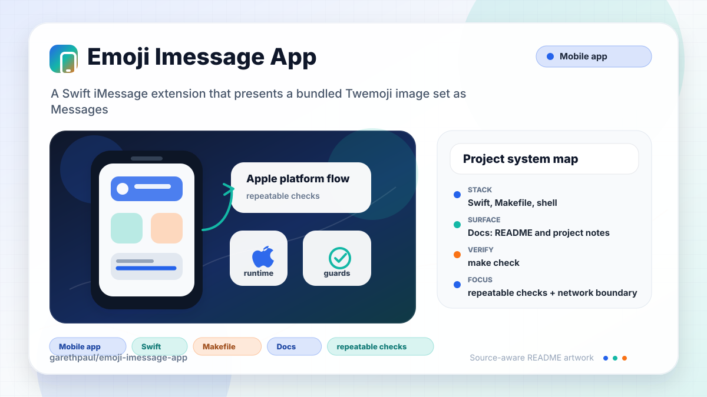

# emoji-imessage-app

<!-- README-OVERVIEW-IMAGE -->


## Overview

`garethpaul/emoji-imessage-app` is a Swift iMessage extension that presents a
bundled Twemoji image set as Messages stickers. It is a legacy Swift 3 / iOS 10
Xcode project and has no network or analytics behavior in the checked-in source.

## Repository Contents

- `README.md` - project overview and local usage notes
- `CHANGES.md` - maintenance history
- `Makefile` - local verification entry points
- `MessagesExtension` - source or example code
- `SECURITY.md` - security reporting and disclosure guidance
- `Twemoji` - source or example code
- `Twemoji.xcodeproj` - Xcode project file
- `VISION.md` - project direction and maintenance guardrails

Additional project context:

- Source directories: MessagesExtension, Twemoji
- Dependency and build manifests: Makefile, Twemoji.xcodeproj
- Entry points or build surfaces: Twemoji.xcodeproj, Makefile
- Test-looking files: no obvious test files detected

## Getting Started

### Prerequisites

- Git
- macOS with Xcode for building Apple platform projects
- Python 3 for the repository baseline script
- `make`

### Setup

```bash
git clone https://github.com/garethpaul/emoji-imessage-app.git
cd emoji-imessage-app
```

This project preserves a Swift 3 / iOS 10-era baseline. Use a matching Xcode
toolchain for full builds or migration work.

## Running or Using the Project

- Open `Twemoji.xcodeproj` in Xcode, choose the app or sample scheme, and run it on the matching simulator/device.
- The Messages extension loads bundled PNG stickers from `MessagesExtension`
  deterministically by filename.
- Sticker discovery filters bundled resources by case-insensitive PNG path
  extension.
- Sticker creation uses exact discovered PNG file paths, keeping resource
  discovery and loading aligned with bundled filename casing.
- Sticker asset names are derived by stripping only the PNG path extension.
- Sticker loading reloads the sticker browser after every load attempt, including
  fail-closed resource lookup paths.
- The extension does not request device permissions and does not include network
  or analytics code in the checked-in Swift sources.
- Sticker loading fails closed without debug logging of bundle paths, asset
  names, or errors.

## Testing and Verification

Run the static maintenance gate:

```bash
make check
make lint
make test
make build
```

`make check` validates the Xcode project references, extension plists, Swift
source invariants, child-controller setup order, and bundled Twemoji PNG
signatures. It also scans Swift sources for network, analytics, ad identifier,
camera, microphone, location, webview APIs, and debug logging. `make lint`,
`make test`, and `make build` run the same static baseline on machines without
Xcode. When `xcodebuild` is installed, the baseline checks that Xcode can read
`Twemoji.xcodeproj`.

For full Apple-platform verification, open `Twemoji.xcodeproj` in Xcode and run
the app/extension on an iOS simulator or device.

When the required SDK or runtime is unavailable, use static checks and source review first, then verify on a machine that has the matching platform toolchain.

## Configuration and Secrets

- No required secret or credential file is used by this extension.
- Do not commit signing certificates, provisioning profiles, Xcode user data,
  build products, or private assets.
- `.gitignore` and `scripts/check-baseline.sh` guard common signing artifacts
  such as `.mobileprovision`, `.provisionprofile`, `.p12`, `.cer`, and
  `.xcarchive` files.

## Security and Privacy Notes

- Review changes touching sticker asset discovery, extension plist metadata,
  bundle resources, signing, and Messages extension lifecycle callbacks.
- Keep the extension free of message-content collection, analytics, and network
  behavior unless a future change documents the user value and privacy model.
- Keep sticker loading free of debug logging that reveals bundle paths, asset
  names, or local errors.
- Keep sticker loading responsible for its own browser reload so failed loads do
  not leave stale stickers visible.

## Maintenance Notes

- This looks like an Apple platform project or sample. Xcode, Swift, CocoaPods, and deployment target versions may need to match the original project era.
- See `SECURITY.md` for vulnerability reporting and safe research guidance.
- See `VISION.md` for project direction and contribution guardrails.
- See `docs/plans/2026-06-08-emoji-imessage-app-maintenance-baseline.md` for
  the current baseline plan.
- See `docs/plans/2026-06-09-emoji-imessage-child-lifecycle.md` for the
  sticker browser child-controller lifecycle guard.
- See `docs/plans/2026-06-09-emoji-imessage-privacy-source-guard.md` for the
  Swift privacy source guard.
- See `docs/plans/2026-06-09-emoji-imessage-asset-name-normalization.md` for
  sticker asset-name normalization.
- See `docs/plans/2026-06-09-emoji-imessage-png-extension-filter.md` for the
  sticker PNG extension filter.
- See `docs/plans/2026-06-09-emoji-imessage-discovered-resource-paths.md` for
  exact discovered PNG resource path loading.
- See `docs/plans/2026-06-09-emoji-imessage-signing-artifact-guard.md` for the
  signing and local Xcode artifact guard.
- See `docs/plans/2026-06-09-emoji-imessage-debug-logging-guard.md` for the
  Swift debug logging guard.
- See `docs/plans/2026-06-09-emoji-imessage-load-reload-ownership.md` for sticker
  browser reload ownership during sticker loading.

## Contributing

Keep changes small and tied to the project that is already present in this repository. For code changes, document the toolchain used, avoid committing generated dependency directories or local configuration, and update this README when setup or verification steps change.
